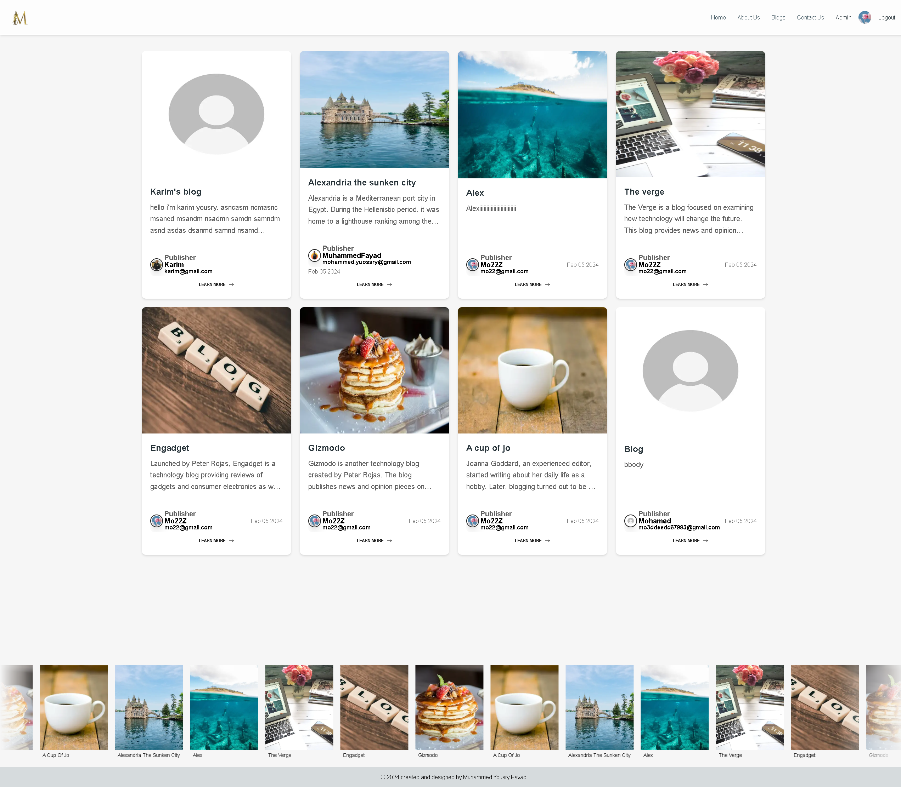

<div id="top"></div>


<!-- PROJECT LOGO -->
<div align="center">
  <h1>Blogly Website</h1>
</div>

<br>
<br>
<br>
<br>

<!-- TABLE OF CONTENTS -->
  <h2>Table of Contents</h2>
  <ol>
    <li><a href="#overview">Overview</a></li>
    <li><a href="#stack">Stack</a></li>
    <li><a href="#getting-started">Getting Started</a></li>
    <li><a href="#installation">Installation</a></li>
    <li><a href="#demo">Live Demo</a></li>
    <li><a href="#preview-image">Preview Image</a></li>
    <li><a href="#preview-link">Preview Link</a></li>
    <li><a href="#trial-credentials">Trial Credentials</a></li>
    <li><a href="#reports">Reports</a></li>
    <li><a href="#contact">Contact</a></li>
  </ol>

<br>
<br>
<br>

<!-- ABOUT THE PROJECT -->

## Overview

#### Blogy is a fully functional blogs webiste. 
##### Implemented authentication with next-auth (github & credentials) providers, you can register, login, log out and create new blogs. Users can only update or delete existing ones that they have published. It allows users to create, read and share their thoughts with the world. Users can sign up or log in using email and password authentication or their GitHub accounts. Once logged in they are able to view all published blogs


## Stack

- nextjs 14
- react.js
- mongoose
- next-auth
- tailwind
- material-tailwind
- framer-motion
- bcrypt

---

<!-- GETTING STARTED -->

## Getting Started

This project require some prequesites and dependenscies to be installed, you can find the instructions below

> To get Started, follow these simple steps :

## Installation

1. Clone the repo

2. go to project folder

3. install dependencies

   ```bash
   npm i
   npm start
   ```

<br>
<br>


### Preview Image





## Preview Link

[]()

## Trial Credentials
user: you can use your github or sign up through the form.

admin: you can send me an email  for admin credentials <a href='#contact'>contact me</a>.


#### Reports

<details>
    <summary>Website Stats Desktop Report</summary>
    
</details>

<details>
    <summary>Website Stats Moblie Report</summary>
    
</details>
<br>
<br>
<br>

#### Contact

<br>

If there is any issue, please feel free to contact me.

📫 Please hit me up at ✉️[mohammed.yuossry@gmail.com](mailto:mohammed.yuossry@gmail.com) if you have any feedback or improvements.<br><br><br>

🤩 Leave a :star:&nbsp;if you like it!

<p align="right"><a href="#top"></a></p>


